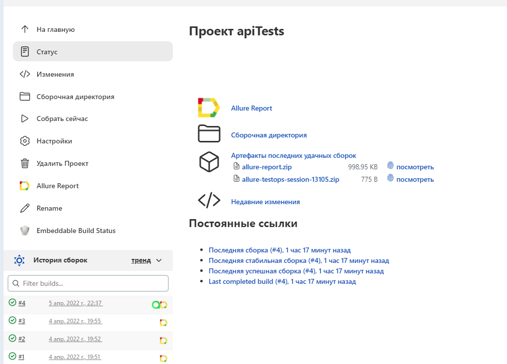
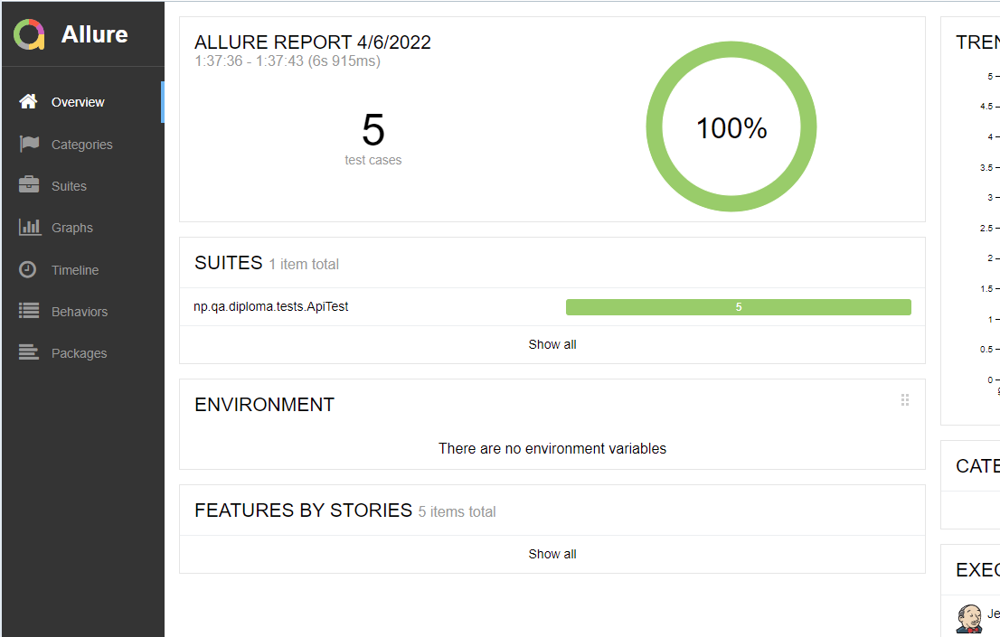
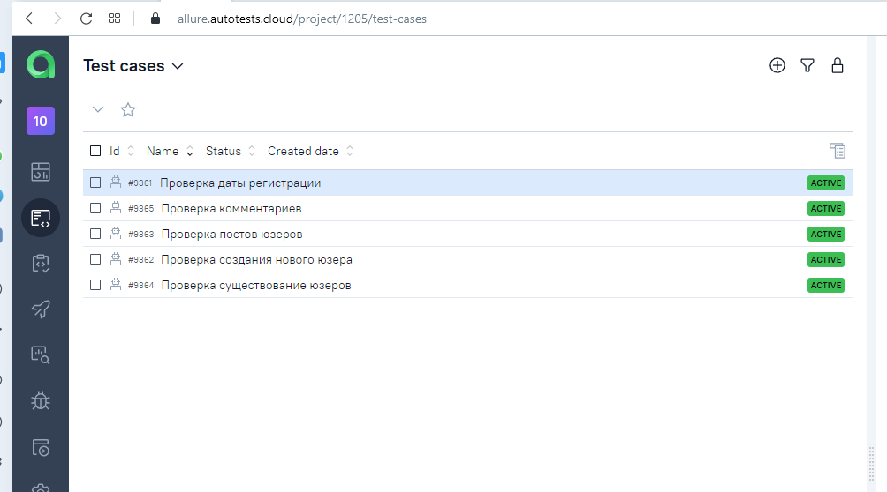
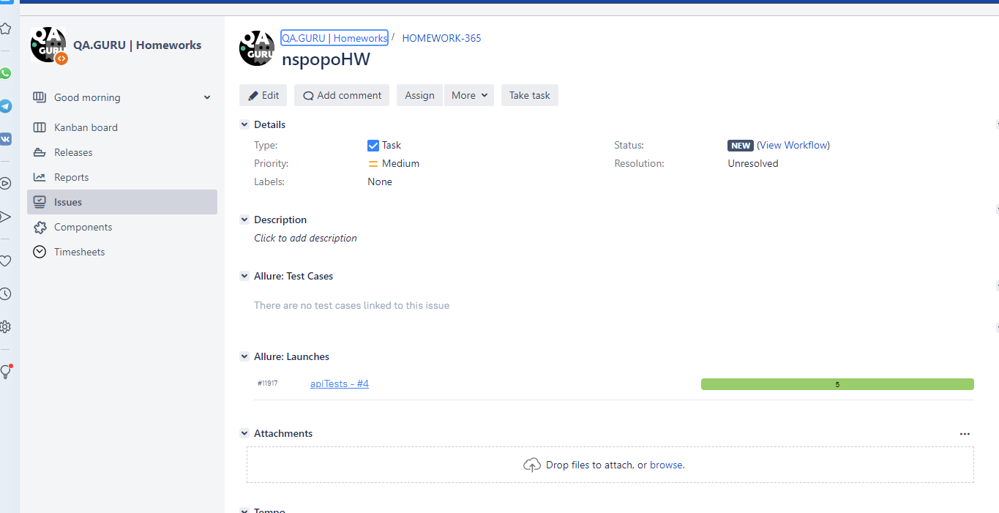

# Диплом(API)
<a target="_blank" href="https://dummyapi.io">dummyapi.io</a>

## :pushpin: Содержание:

- [Технологии и инструменты](#rocket-технологии-и-инструменты)
- [Реализованные проверки](#Реализованные-проверки)
- [Jenkins job](#-Jenkins-job)
- [Allure отчет](#-Allure-отчет)
- [Allure testOps](#-Allure-testOps)
- [Jira](#-Jira)

## :rocket: Технологии и инструменты

<p align="center">
<a href="https://www.jetbrains.com/idea/"></a>
<a href="https://www.java.com/"></a>
<a href="https://github.com/"></a>
<a href="https://junit.org/junit5/"></a>
<a href="https://gradle.org/"></a>
<a href="https://github.com/allure-framework/allure2"></a>
<a href="https://www.jenkins.io/"></a>
<a href="https://rest-assured.io/"></a>
<a href="https://qameta.io/"></a>
<a href="https://www.atlassian.com/ru/software/jira"></a>
</p>

## Реализованные проверки

- ✓ Проверка даты регистрации.
- ✓ Проверка комментариев.
- ✓ Проверка постов юзеров.
- ✓ Проверка создания нового юзера
- ✓ Проверка существование юзеров

## </a> Jenkins job
<a target="_blank" href="https://jenkins.autotests.cloud/job/apiTests/">Сборка в Jenkins</a>
<p align="center">
<a href="https://jenkins.autotests.cloud/job/apiTests/"></a>
</p>

## :computer: Запуск тестов из терминала

Локальный и удаленный запуск:
```bash
gradle clean test
```


## </a> Allure отчет

<a target="_blank" href="https://jenkins.autotests.cloud/job/apiTests/4/allure">Аллюр</a>

<p align="center">

</p>


## </a> Allure testOps

<a target="_blank" href="https://allure.autotests.cloud/project/1205/test-cases?treeId=0">Аллюр EE</a>
<p align="center">

</p>


### </a> Jira
<a target="_blank" href="https://jira.autotests.cloud/browse/HOMEWORK-365">Таск в Jira</a>
<p align="center">
 
</p>
